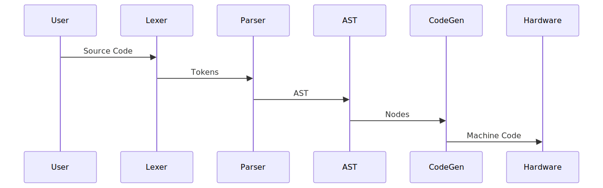

# MyLang Compiler + AsmIDE Project Documentation

## Overview

**MyLangCompiler + AsmIDE** is a Blazor WebAssembly-based IDE and compiler toolchain for a custom 8-bit computer architecture.
MyLang is a custom language compiler targeting a custom 8-bit ISA I made I while ago, see my blog post about it: <a href="https://eecs.blog/8-bit-computer-in-an-fpga/" target="_blank">EECS Blog: 8-bit Computer in an FPGA</a>

Initially I was going to make a C compiler for learning/fun but then I thought I'd be nice if I actually made simple compiler for my 8 bit computer I made.

<br>

**Web App:** [AsmIDE + MyLang Compiler](https://eecs.blog/BlazorApps/MyLangCompiler/)

**GitHub Repo:** [8-Bit Computer](https://github.com/EECSB/8Bit-Computer)

<br>

### The project combines:

- A browser-based code editor UI
- A custom high-level language compiler (`.mylang`)
- Assembly generation
- Machine code generation
- Symbol/debug output
- Hardware upload via serial communication

### Core Purpose

The system enables users to:

1. Write code in a simplified educational programming language
2. Compile it into assembly or machine code
3. Debug symbol mappings
4. Upload binaries to custom hardware

---

# High-Level System Architecture

<div align="center">
<!-- System Architecture Diagram -->

</div>

---

# Project Structure

```text
MyLangCompiler/
│
├── Code/
│   └── Compiler.cs              # Full compiler pipeline
│
├── Pages/
│   └── Home.razor               # Main IDE UI
│
├── Layout/
│   └── MainLayout.razor         # App shell
│
├── NpmJS/
│   └── MonacoInterop.js         # Monaco code editor integration
│
├── wwwroot/
│   ├── js/
│   │   ├── JSUtils.js
│   │   └── SerialInterop.js     # Browser serial APIs
│   │
│   └── Test/                    # Sample programs and generated code
│
└── README.md / ARCHITECTURE.md
```

---

# Compiler Pipeline

## Compilation Stages

<div align="center">
<!-- Compiler Pipeline Diagram -->

</div>

---

# Compiler Internals

## 1. Lexer (Tokenizer)

### Responsibilities

The lexer scans raw source code and converts it into structured tokens.

### Supported Token Types

- Identifiers
- Numbers
- Operators (`+`, `-`, `*`, `/`)
- Comparisons (`==`, `>`, `<`)
- Assignment (`=`)
- Keywords:
  - `if`
  - `else`
  - `goto`
  - `print`
- Delimiters:
  - `(` `)`
  - `{` `}`
  - `:` `;`

### Features

- Whitespace skipping
- Line tracking
- Comment skipping (`//`)
- Error reporting with line numbers

### Lexer Workflow

<div align="center">
<!-- Lexer Workflow Diagram -->

</div>

---

# 2. Parser

The parser converts tokens into an **Abstract Syntax Tree (AST)**.

## Supported Statements

### Labels
```mylang
start:
```

### Variable Assignment
```mylang
x = 5;
y = x + 2;
```

### Printing
```mylang
print(x);
```

### Goto
```mylang
goto start;
```

### Conditional Blocks
```mylang
if x > 5 {
    print(x);
} else {
    print(0);
}
```

---

## Parser Architecture

<div align="center">
<!-- AST Structure Diagram -->

</div>

---

# 3. Abstract Syntax Tree Design

The AST preserves logical program structure while abstracting syntax.

## Example Source

```mylang
x = 5;
y = x + 2;
print(y);
```

## AST Representation

<div align="center">
<!-- AST Example Diagram -->

</div>

---

# 4. Code Generator

The code generator transforms AST nodes into target assembly.

## Internal Responsibilities

- Variable allocation
- Label resolution
- Jump fixups
- Immediate value validation
- Symbol mapping
- Data section generation
- Machine code translation

---

## Code Generation Flow

<div align="center">
<!-- Code Generation Flow Diagram -->

</div>

---

# Assembly Instruction Set

## Default Opcodes

| Instruction | Purpose |
|------------|---------|
| `LDA` | Load from memory |
| `LDAD` | Load immediate |
| `STA` | Store accumulator |
| `ADD` | Add |
| `SUB` | Subtract |
| `OUT` | Output |
| `JMP` | Unconditional jump |
| `JMC` | Jump on carry |
| `JMZ` | Jump on zero |
| `HLT` | Halt |

---

# Arithmetic Handling

## Native Support

- Addition
- Subtraction

## Emulated Support

### Multiplication
Implemented using repeated addition loops.

### Division
Implemented using repeated subtraction loops.

This allows high-level arithmetic on minimal hardware.

---

# Variable & Memory Model

## Memory Layout

<div align="center">
<!-- Memory Layout Diagram -->

</div>

### Key Concepts

- Variables are assigned sequential memory addresses
- Temporary variables are generated for expressions
- Literal initialization may be optimized into data section
- Labels are resolved after instruction generation

---

# Output Modes

## 1. Assembly
Human-readable generated assembly.

## 2. Machine Code
Binary/encoded opcode output.

## 3. Symbols
Assembly plus:

- Source line mapping
- Variable names
- Debug metadata

---

# Compiler Entry Point

## Main API

```csharp
Compiler.Compile(
    sourceCode,
    bits,
    outputType,
    opcodeDefinition,
    memAddressLength,
    memWordLength,
    memSize
)
```

### Steps:

1. Lex source code
2. Parse token stream
3. Build AST
4. Generate code
5. Resolve labels/variables
6. Output selected format

---

# UI Architecture

<div align="center">
<!-- UI Architecture Diagram -->

</div>

---

# Strengths of the Design

## Advantages

- Modular compiler stages
- Educational readability
- Hardware abstraction
- Browser-based IDE
- Symbol/debug generation
- Custom opcode definitions
- Extensible architecture

---

# Current Limitations

## Known Constraints

- Single-file compiler implementation (`Compiler.cs` is large)
- Limited syntax features
- Minimal optimization
- Basic error handling
- Multiplication/division are expensive
- `<` operator support incomplete at ISA level
- No advanced type system

---

# Recommended Future Improvements

## Compiler Enhancements

- Split compiler into separate files/modules
- Add semantic analysis stage
- Implement optimizer passes
- Add function definitions
- Add loops (`while`, `for`)
- Improve diagnostics
- Add register allocation
- Expand ISA support

## IDE Enhancements

- Syntax highlighting
- Breakpoints
- Step debugging
- Hardware memory viewer
- Project system

---

# End-to-End Example

## Source
```mylang
x = 5;
y = x + 2;
print(y);
```

## Compilation Sequence

<div align="center">
<!-- Compilation Sequence Diagram -->

</div>

---